<h3><code>krishna@github ~ $ ./contributions.sh</code></h3>

  

<h3><code>krishna@github ~ $ whoami</code></h3>
<table>
  <tr>
    <td valign="top"></td>
    <td valign="top"></td>
  </tr>
</table>

 

